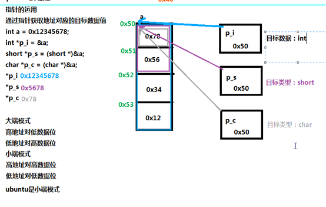
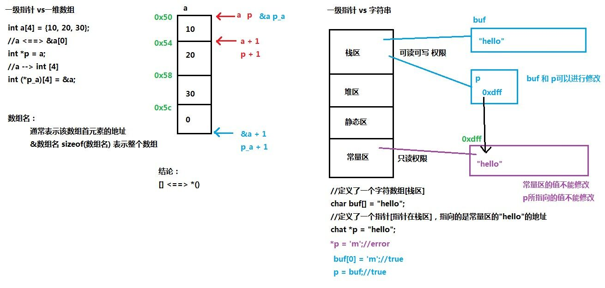
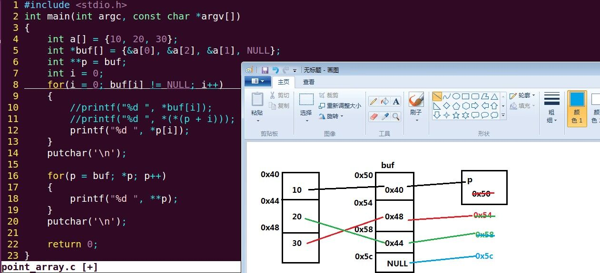
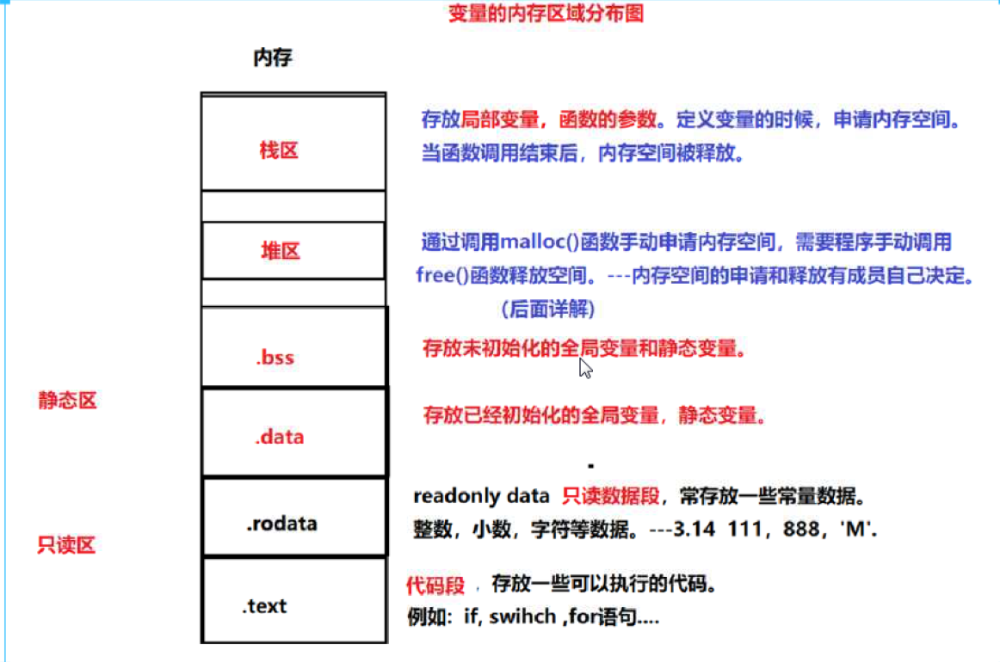

# C语言

## 分支与循环

- 条件运算符: 需要把两个值中的一个赋值给变量时,就可以用条件表达式,` max = (a > b) ? a: b; 如果 a > b, 则把a给max，否则把b赋值给max`

## 指针

### 大端小端(**记住低对低是小端即可, arm大端, x86小端**)

### 一级指针

### 二级指针

# 1017测试

- C语言中，运算对象必须是整形数的运算符是 `%`
- 表达式 `!x` 等价于 `x == 0`
## 变量的内存分配图

## 字符串处理函数

## 断言 assert

## const常量

- `const int *p`         p 可变, *p 不可变
- `int const *p`         p 可变, *p 不可变
- `int *const p`         p 不可变, * 可变
- `const int * const p`  p 不可变, *p 不可变

## 内存管理

### stdlib.h

#### `int *p = NULL; p = malloc(sizeof(struct))`

### string.h

#### `memset(p, 0, sizeof(p))`

# 二维数组与指针 `(int (*p)[2] = a)`

## 行指针(也就是将 `a[i]` 看作 二维数组 行地址)

- `p + 1 <==> &a[0] + 1 <==> &a[1]`
- `*(p + 1) <==> *(&a[1]) <==> a[1] <==> &a[1][0]`
- `*(*(p + 1)) <==> *(&a[1][0]) <==> a[1][0]`
- `结论：a[i][j] <==> *(a[i] + j) <==> *(*(a + i) + j) <==> *(p[i] + j) <==> p[i][j]`

## 列指针

- `a[0] <==> &a[0][0]`
- `a[0] + 1 <==> &a[0][0] + 1 == &a[0][1]`
