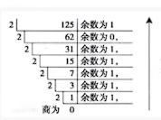
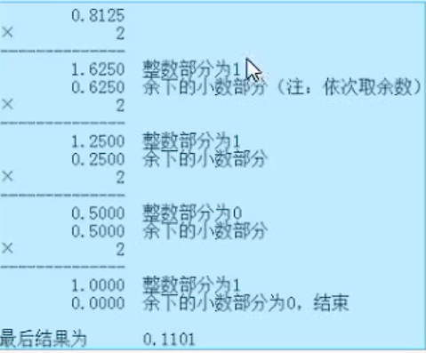

# Day2

## linux基础命令

### cp 命令

- -f选项 强制复制
- -i 若有重复文件，会询问是否覆盖
- -r 递归复制，用于目录复制

### mv 命令

- mv 旧文件 新文件 ： 改名

### rm 命令

- rm -rf 文件夹： 删除文件夹

### 清屏命令

- reset：清屏后上翻无历史记录
- clear
- ctrl+L

### 底栏模式

- r 文件名：导入文件内容到光标位置
- q! 强制退出

# Day3

## 计算机基础知识

### 计算机系统

### 计算机基本组成

### 计算机硬件与程序执行

### 计算机进位计数制

### 计算机基础

- 计算机的最小集成单位为位(bit)，二进制的位数一般为8位，16位，32位，64位(也就是8的倍数)，把八位二进制数称为一个字节(计算机存储中最基本的存储单位为直接)

### 进制

#### 十进制

- 基数：10

#### 二进制

- 二进制->十进制：(0.101)2 = 1x2^(-1) + 0x2^(-2) + 1x2^(-3)
- 十进制->二进制：除基取余
- 十进制->二进制(小数部分)：
- 位权：2^(n-1)

#### 八进制(0开头)

- 基数：8
- 八进制->十进制：(377)8 = 3x8^2 + 7x8^1 + 7x8^0
- (713)8 + (114)8 = (1027)8
  也就是  0713
  0114
  01207
- 位权：8^(n-1)

#### 十六进制数

- 可使用的数码：0,1,2,3,4,5,6,7,8,9,a,b,c,d,e,f
- 基数：16
- 十六进制->十进制：0x27b = 2x16^2 + 7x16^1 + bx16^0
- 0x27b + 0x18a = 0x405

#### 进制间的相互转换

- 二进制->八进制：每三位为八进制一位
- 八进制->二进制：每一位为二进制三位
- 

#### 八进制->二进制常用数码

- 0 000
- 1 001
- 2 010
- 3 011
- 4 100
- 5 101
- 6 110
- 7 111

#### 十六进制->二进制常用数码

- 0 0000
- 1 0001
- 2 0010
- 3 0011
- 4 0100
- 5 0101
- 6 0110
- 7 0111
- 8 1000
- 9 1001
- a 1010
- b 1011
- c 1100
- d 1101
- e 1110
- f 1111

### 计算机编码

#### 源码(一般以八位二进制数为主)

- 最高位表示符号位
- 其他位表示绝对值
- 1 表示负号
- 0 表示非负数
- 7(8位)：0 000 0111 -- 扩展为16位：0 000 0000 0000 0111
- -7(8位)：1 000 0111 -- 扩展为16位：1 000 0000 0000 0111
- +0(8位)：0 000 0000
- -0(8位)：1 000 0000

#### 反码
- 非负数：和源码相同
- 负数
- 符号位不变，对源码其他位依次取反
- 0变1，1变0
- 7(8位)反码：0 000 0111 -- 扩展为16位：0 000 0000 0000 0111
- -7(8位)反码：1 111 1000 -- 扩展为16位：1 111 1111 1111 1000
- +0：0 000 0000
- -0：1 111 1111

#### 补码
- 非负数：和源码相同
- 复数：反码 + 1
- 7(8位)补码：0 000 0111 -- 扩展为16位：0 000 0000 0000 0111
- -7(8位)补码：1 111 1111 1111 1001 -- 扩展为16位：1 111 1111 1111 1001
- 0的补码：0000 0000
- 特殊的补码：1 000 0000/1 1000 0000 最高位的1是符号位和绝对值重叠的位
- 特殊的补码：-0：1 0000 0000 规定-0表示-128
- 数据在内存中总是以补码的形式存放的，最高位为符号位

# Day4

# Day5
